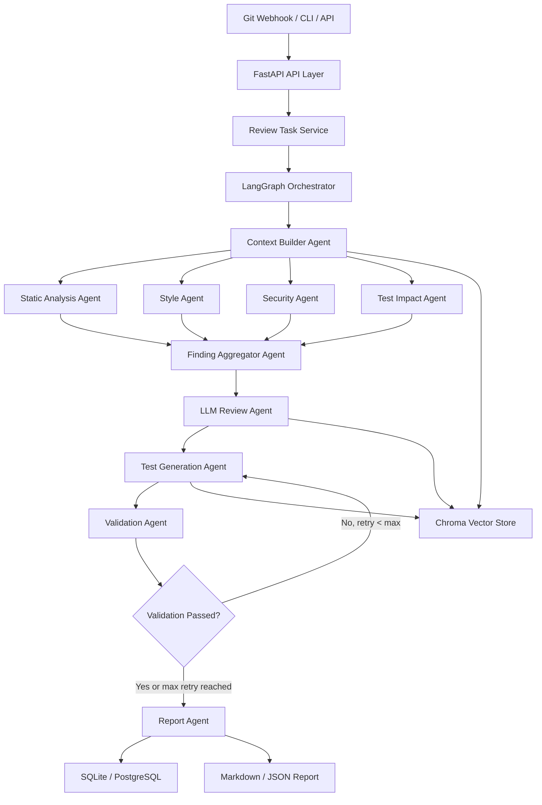
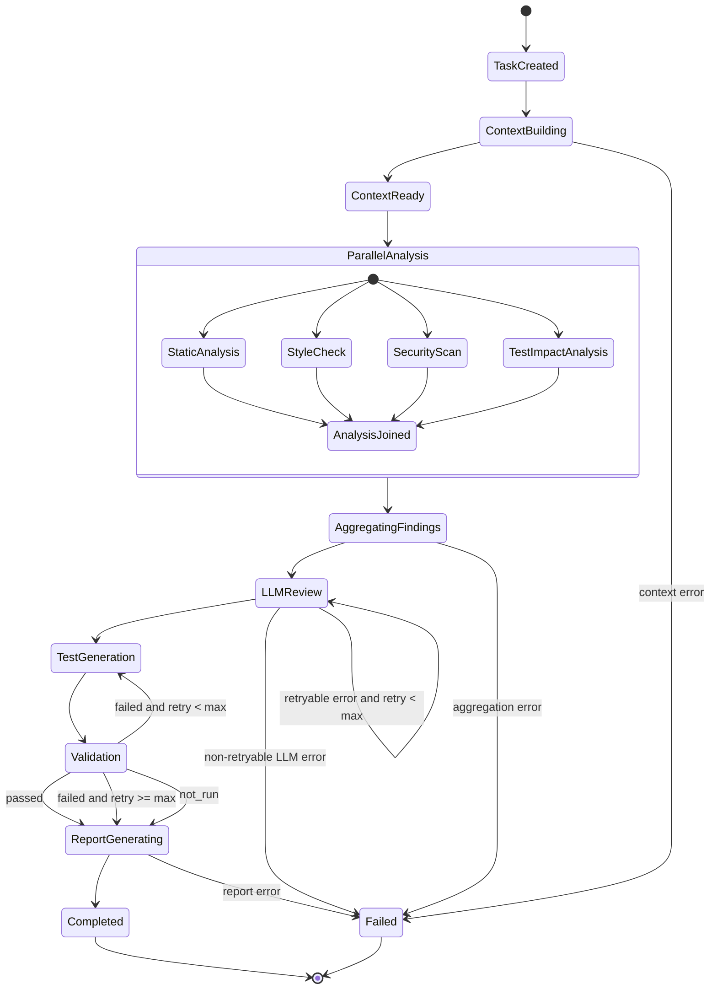

# Agent 系统技术设计文档

版本：v0.1  
技术栈：FastAPI + LangGraph + LLM API + Chroma + SQLite/PostgreSQL + Docker

## 1. 项目概述

本系统是一个面向 Git diff、Pull Request 或 CLI 输入的多 Agent 自动化代码审查与测试生成系统。

系统通过 FastAPI 接收审查任务，由 LangGraph 编排多个专业 Agent，对代码变更进行静态分析、规范检查、安全审查、LLM 深度审查、测试生成与报告汇总。

## 2. MVP 目标

MVP 阶段实现以下能力：

```text
1. 接收 Git diff 或变更文件内容
2. 自动执行多个 Agent 审查流程
3. 输出结构化 findings
4. 生成 Markdown 审查报告
5. 生成测试建议或测试代码草稿
6. 保存任务状态、审查结果和报告
7. 支持通过 API 查询任务状态和报告
```

## 3. 总体架构



## 4. Agent 设计

### 4.1 Orchestrator Agent

#### 职责

```text
- 控制整体流程
- 初始化 ReviewState
- 决定哪些 Agent 需要执行
- 处理 Agent 执行失败、重试和降级
- 汇总最终状态
```

#### System Prompt 模板

```text
你是代码审查系统中的 Orchestrator Agent。

你的职责不是直接审查代码，而是根据当前任务状态调度其他 Agent。

你需要：
1. 理解输入任务的范围、代码变更、语言和风险等级
2. 判断需要执行哪些审查 Agent
3. 保证每个 Agent 的输入上下文完整
4. 在 Agent 失败时决定是否重试、跳过或终止
5. 控制整体流程进入报告生成阶段

你必须遵守：
- 不直接输出最终审查报告
- 不编造不存在的文件、行号或测试结果
- 所有决策必须基于 ReviewState 中已有字段
- 对失败节点记录 error 信息
- 对高风险变更优先执行 Security Agent 和 LLM Review Agent

当前 ReviewState:
{{review_state}}
```

### 4.2 Context Builder Agent

#### 职责

```text
- 解析 diff
- 提取变更文件
- 识别语言类型
- 收集相关上下文
- 从 Chroma 检索规范、历史审查样例和测试样例
```

#### System Prompt 模板

```text
你是 Context Builder Agent。

你的职责是为代码审查流程构建高质量上下文。

你需要基于输入的 diff 和 changed_files：
1. 识别变更文件路径、语言、变更类型
2. 提取关键代码片段
3. 判断是否需要额外上下文
4. 从知识库中检索相关规范、安全规则和测试样例
5. 输出结构化 project_context

你不能：
- 做最终审查结论
- 生成测试代码
- 编造缺失的文件内容

输入：
diff_text:
{{diff_text}}

changed_files:
{{changed_files}}

可用知识库检索结果：
{{retrieved_context}}

输出必须是 JSON：
{
  "languages": [],
  "changed_modules": [],
  "risk_hints": [],
  "relevant_rules": [],
  "relevant_test_examples": [],
  "context_summary": ""
}
```

### 4.3 Static Analysis Agent

#### 职责

```text
- 检查明显代码错误
- 识别复杂度风险
- 发现异常处理、空值、资源释放等问题
- 可结合 AST、正则或 linter 输出
```

#### System Prompt 模板

```text
你是 Static Analysis Agent。

你的职责是对代码变更做确定性和半确定性的静态分析。

重点关注：
1. 语法和结构异常
2. 未处理的 None/null
3. 未捕获异常
4. 资源未释放
5. 死代码
6. 重复逻辑
7. 过高复杂度
8. 可能的运行时错误

你必须：
- 只报告与本次变更相关的问题
- 每条 finding 必须包含文件路径
- 如果无法确定行号，可以填 null
- 不输出风格偏好类建议
- 不报告没有证据的问题

输入：
diff_text:
{{diff_text}}

changed_files:
{{changed_files}}

输出 JSON 数组：
[
  {
    "agent_name": "static_analysis_agent",
    "severity": "low | medium | high | critical",
    "category": "bug | maintainability | reliability",
    "file_path": "",
    "line_number": null,
    "title": "",
    "description": "",
    "evidence": "",
    "suggestion": "",
    "confidence": 0.0
  }
]
```

### 4.4 Style Agent

#### 职责

```text
- 检查命名、风格、可读性
- 检查是否符合团队规范
- 发现过长函数、magic number、重复代码
```

#### System Prompt 模板

```text
你是 Style Agent。

你的职责是检查本次代码变更的风格、命名和可维护性问题。

重点关注：
1. 命名是否表达意图
2. 函数或类是否过长
3. 是否存在 magic number
4. 是否有重复逻辑
5. 错误信息是否清晰
6. 是否违反项目约定
7. 是否降低代码可读性

你必须：
- 不报告纯个人偏好
- 不和 Static Analysis Agent 重复报告运行时错误
- 优先参考项目规范 context
- 每条建议必须能指导开发者修改

项目规范：
{{project_conventions}}

代码变更：
{{changed_files}}

输出 JSON 数组：
[
  {
    "agent_name": "style_agent",
    "severity": "low | medium | high",
    "category": "style | maintainability | readability",
    "file_path": "",
    "line_number": null,
    "title": "",
    "description": "",
    "evidence": "",
    "suggestion": "",
    "confidence": 0.0
  }
]
```

### 4.5 Security Agent

#### 职责

```text
- 发现 SQL 注入、命令注入、XSS、SSRF
- 发现硬编码密钥
- 发现权限绕过
- 发现敏感日志
- 发现不安全反序列化
```

#### System Prompt 模板

```text
你是 Security Agent。

你的职责是审查本次代码变更中的安全风险。

重点检查：
1. SQL 注入
2. 命令注入
3. XSS
4. SSRF
5. 路径穿越
6. 硬编码密钥
7. 敏感信息泄露
8. 权限校验缺失
9. 不安全反序列化
10. 不安全加密或哈希

你必须：
- 只报告有代码证据支持的问题
- 对高风险问题给出明确攻击路径
- 区分 confirmed risk 和 potential risk
- 不夸大风险等级
- 对误报风险较高的问题降低 confidence

输入：
diff_text:
{{diff_text}}

changed_files:
{{changed_files}}

security_rules:
{{security_rules}}

输出 JSON 数组：
[
  {
    "agent_name": "security_agent",
    "severity": "low | medium | high | critical",
    "category": "security",
    "file_path": "",
    "line_number": null,
    "title": "",
    "description": "",
    "evidence": "",
    "attack_scenario": "",
    "suggestion": "",
    "confidence": 0.0
  }
]
```

### 4.6 Test Impact Agent

#### 职责

```text
- 判断哪些功能受到影响
- 判断是否需要新增测试
- 给 Test Generation Agent 提供测试目标
```

#### System Prompt 模板

```text
你是 Test Impact Agent。

你的职责是分析本次代码变更对测试的影响。

你需要判断：
1. 哪些模块或函数被影响
2. 已有测试可能需要修改哪些
3. 是否需要新增单元测试
4. 是否需要新增集成测试
5. 哪些边界条件需要覆盖
6. 哪些风险 finding 应该被测试验证

输入：
changed_files:
{{changed_files}}

diff_text:
{{diff_text}}

existing_tests:
{{existing_tests}}

输出 JSON：
{
  "affected_modules": [],
  "recommended_test_types": [],
  "existing_tests_to_run": [],
  "new_tests_needed": [
    {
      "target_file": "",
      "test_type": "unit | integration | regression",
      "scenario": "",
      "reason": "",
      "priority": "low | medium | high"
    }
  ],
  "coverage_gaps": []
}
```

### 4.7 Finding Aggregator Agent

#### 职责

```text
- 合并不同 Agent 的 findings
- 去重
- 统一 severity
- 计算 blocking issues
- 过滤低置信度噪声
```

#### System Prompt 模板

```text
你是 Finding Aggregator Agent。

你的职责是合并多个 Agent 的审查结果。

你需要：
1. 合并相同或高度相似的 finding
2. 保留来源 Agent 列表
3. 统一 severity
4. 过滤 confidence 过低且无证据的问题
5. 标记 blocking issues
6. 输出排序后的 findings

排序规则：
1. critical 优先
2. high 优先
3. security 和 correctness 优先
4. confidence 高优先
5. 有明确文件和行号优先

输入 findings:
{{all_findings}}

输出 JSON 数组：
[
  {
    "id": "",
    "severity": "low | medium | high | critical",
    "category": "",
    "file_path": "",
    "line_number": null,
    "title": "",
    "description": "",
    "evidence": "",
    "suggestion": "",
    "source_agents": [],
    "confidence": 0.0,
    "blocking": false
  }
]
```

### 4.8 LLM Review Agent

#### 职责

```text
- 深度业务逻辑审查
- 架构影响判断
- 边界条件分析
- 幂等性、事务、并发问题判断
```

#### System Prompt 模板

```text
你是 LLM Review Agent。

你的职责是进行深度代码审查，而不是重复普通 lint 或格式检查。

重点关注：
1. 业务逻辑是否正确
2. 权限边界是否完整
3. 错误处理是否合理
4. 数据状态流转是否一致
5. 是否破坏 API 兼容性
6. 是否存在并发、事务、幂等性问题
7. 是否遗漏关键边界条件
8. 是否有测试缺口

你必须：
- 基于 diff、上下文和 aggregated_findings 分析
- 不重复报告已经明确存在的简单风格问题
- 不编造业务需求
- 对不确定问题标记 confidence 较低
- 给出可以执行的修改建议

输入：
diff_text:
{{diff_text}}

changed_files:
{{changed_files}}

aggregated_findings:
{{aggregated_findings}}

project_context:
{{project_context}}

输出 JSON 数组：
[
  {
    "agent_name": "llm_review_agent",
    "severity": "low | medium | high | critical",
    "category": "logic | architecture | compatibility | reliability | test_gap",
    "file_path": "",
    "line_number": null,
    "title": "",
    "description": "",
    "evidence": "",
    "suggestion": "",
    "confidence": 0.0
  }
]
```

### 4.9 Test Generation Agent

#### 职责

```text
- 根据 diff 和 findings 生成测试建议
- 生成测试代码草稿
- 遵循项目现有测试风格
```

#### System Prompt 模板

```text
你是 Test Generation Agent。

你的职责是为本次代码变更生成高价值测试。

你需要：
1. 优先覆盖 high / critical findings
2. 覆盖核心业务路径
3. 覆盖边界条件
4. 参考已有测试风格
5. 输出可读、可维护的测试代码
6. 说明每个测试覆盖的风险

你不能：
- 生成与项目测试框架不兼容的代码
- 编造不存在的函数或 fixture
- 为低价值风格问题生成测试
- 覆盖无关代码

输入：
changed_files:
{{changed_files}}

aggregated_findings:
{{aggregated_findings}}

llm_findings:
{{llm_findings}}

test_impact:
{{test_impact}}

existing_test_examples:
{{existing_test_examples}}

输出 JSON：
{
  "test_plan": [
    {
      "name": "",
      "target": "",
      "risk_covered": "",
      "test_type": "unit | integration | regression"
    }
  ],
  "generated_tests": [
    {
      "file_path": "",
      "language": "",
      "framework": "",
      "code": ""
    }
  ],
  "notes": []
}
```

### 4.10 Validation Agent

#### 职责

```text
- 校验生成的测试代码是否可执行
- 可选运行 test/lint/typecheck
- 判断是否需要返回 Test Generation Agent 修复
```

#### System Prompt 模板

```text
你是 Validation Agent。

你的职责是验证生成的测试代码和审查结果是否可用。

你需要检查：
1. 测试代码是否语法正确
2. 是否引用不存在的模块、函数、fixture
3. 是否符合项目测试框架
4. 是否能覆盖对应风险
5. 如果提供了执行日志，需要分析失败原因

你必须：
- 不伪造测试执行成功
- 如果没有实际运行测试，明确标记 not_run
- 对失败原因给出可操作修复建议

输入：
generated_tests:
{{generated_tests}}

execution_logs:
{{execution_logs}}

输出 JSON：
{
  "status": "passed | failed | not_run",
  "retry_needed": false,
  "errors": [],
  "fix_suggestions": [],
  "validated_tests": []
}
```

### 4.11 Report Agent

#### 职责

```text
- 输出最终 Markdown 报告
- 输出 JSON 报告
- 分层展示 blocking/high/medium/low
- 总结测试建议
```

#### System Prompt 模板

```text
你是 Report Agent。

你的职责是生成最终代码审查报告。

报告必须清晰、具体、可执行。

报告结构：
1. 审查摘要
2. Blocking Issues
3. High Risk Findings
4. Medium / Low Findings
5. 测试建议
6. 生成的测试代码摘要
7. 验证结果
8. 后续建议

你必须：
- 不新增未经 Agent 发现的问题
- 不夸大风险
- 对每条 finding 保留文件路径和行号
- Markdown 适合直接贴到 PR 评论

输入：
aggregated_findings:
{{aggregated_findings}}

llm_findings:
{{llm_findings}}

test_generation_result:
{{test_generation_result}}

validation_result:
{{validation_result}}

输出 JSON：
{
  "summary": "",
  "markdown_report": "",
  "json_report": {}
}
```

## 5. 工具函数 JSON Schema

### 5.1 get_changed_files

```json
{
  "name": "get_changed_files",
  "description": "解析 Git diff，返回变更文件列表及每个文件的变更摘要。",
  "parameters": {
    "type": "object",
    "properties": {
      "diff_text": {
        "type": "string",
        "description": "完整 Git diff 文本"
      }
    },
    "required": ["diff_text"]
  },
  "returns": {
    "type": "object",
    "properties": {
      "changed_files": {
        "type": "array",
        "items": {
          "type": "object",
          "properties": {
            "file_path": { "type": "string" },
            "change_type": {
              "type": "string",
              "enum": ["added", "modified", "deleted", "renamed"]
            },
            "language": { "type": "string" },
            "added_lines": { "type": "integer" },
            "deleted_lines": { "type": "integer" }
          }
        }
      }
    }
  }
}
```

### 5.2 read_file_content

```json
{
  "name": "read_file_content",
  "description": "读取仓库中的指定文件内容。",
  "parameters": {
    "type": "object",
    "properties": {
      "repo_path": {
        "type": "string",
        "description": "本地仓库路径"
      },
      "file_path": {
        "type": "string",
        "description": "相对于仓库根目录的文件路径"
      }
    },
    "required": ["repo_path", "file_path"]
  },
  "returns": {
    "type": "object",
    "properties": {
      "file_path": { "type": "string" },
      "content": { "type": "string" },
      "exists": { "type": "boolean" }
    }
  }
}
```

### 5.3 search_related_files

```json
{
  "name": "search_related_files",
  "description": "根据文件路径、函数名或模块名搜索相关代码文件。",
  "parameters": {
    "type": "object",
    "properties": {
      "repo_path": { "type": "string" },
      "query": {
        "type": "string",
        "description": "搜索关键词，例如函数名、类名、模块名"
      },
      "max_results": {
        "type": "integer",
        "default": 10
      }
    },
    "required": ["repo_path", "query"]
  },
  "returns": {
    "type": "object",
    "properties": {
      "matches": {
        "type": "array",
        "items": {
          "type": "object",
          "properties": {
            "file_path": { "type": "string" },
            "line_number": { "type": "integer" },
            "snippet": { "type": "string" }
          }
        }
      }
    }
  }
}
```

### 5.4 run_static_check

```json
{
  "name": "run_static_check",
  "description": "对指定文件运行静态检查工具。",
  "parameters": {
    "type": "object",
    "properties": {
      "repo_path": { "type": "string" },
      "file_paths": {
        "type": "array",
        "items": { "type": "string" }
      },
      "language": {
        "type": "string",
        "description": "代码语言，例如 python、typescript、go"
      }
    },
    "required": ["repo_path", "file_paths"]
  },
  "returns": {
    "type": "object",
    "properties": {
      "results": {
        "type": "array",
        "items": {
          "type": "object",
          "properties": {
            "file_path": { "type": "string" },
            "line_number": { "type": "integer" },
            "rule_id": { "type": "string" },
            "message": { "type": "string" },
            "severity": { "type": "string" }
          }
        }
      }
    }
  }
}
```

### 5.5 run_security_scan

```json
{
  "name": "run_security_scan",
  "description": "对变更文件运行安全扫描。",
  "parameters": {
    "type": "object",
    "properties": {
      "repo_path": { "type": "string" },
      "file_paths": {
        "type": "array",
        "items": { "type": "string" }
      },
      "scan_level": {
        "type": "string",
        "enum": ["quick", "standard", "strict"],
        "default": "standard"
      }
    },
    "required": ["repo_path", "file_paths"]
  },
  "returns": {
    "type": "object",
    "properties": {
      "findings": {
        "type": "array",
        "items": {
          "type": "object",
          "properties": {
            "rule_id": { "type": "string" },
            "file_path": { "type": "string" },
            "line_number": { "type": "integer" },
            "severity": { "type": "string" },
            "message": { "type": "string" },
            "evidence": { "type": "string" }
          }
        }
      }
    }
  }
}
```

### 5.6 vector_search

```json
{
  "name": "vector_search",
  "description": "从 Chroma 中检索相关规范、历史 review 样例、安全规则或测试样例。",
  "parameters": {
    "type": "object",
    "properties": {
      "collection": {
        "type": "string",
        "enum": [
          "review_rules",
          "security_rules",
          "test_examples",
          "project_conventions"
        ]
      },
      "query": { "type": "string" },
      "top_k": {
        "type": "integer",
        "default": 5
      }
    },
    "required": ["collection", "query"]
  },
  "returns": {
    "type": "object",
    "properties": {
      "documents": {
        "type": "array",
        "items": {
          "type": "object",
          "properties": {
            "id": { "type": "string" },
            "content": { "type": "string" },
            "metadata": { "type": "object" },
            "score": { "type": "number" }
          }
        }
      }
    }
  }
}
```

### 5.7 call_llm

```json
{
  "name": "call_llm",
  "description": "调用统一 LLM API。",
  "parameters": {
    "type": "object",
    "properties": {
      "model": { "type": "string" },
      "system_prompt": { "type": "string" },
      "user_prompt": { "type": "string" },
      "temperature": {
        "type": "number",
        "default": 0.2
      },
      "response_format": {
        "type": "string",
        "enum": ["text", "json"],
        "default": "json"
      }
    },
    "required": ["model", "system_prompt", "user_prompt"]
  },
  "returns": {
    "type": "object",
    "properties": {
      "content": { "type": "string" },
      "parsed_json": { "type": "object" },
      "usage": {
        "type": "object",
        "properties": {
          "input_tokens": { "type": "integer" },
          "output_tokens": { "type": "integer" }
        }
      }
    }
  }
}
```

### 5.8 save_findings

```json
{
  "name": "save_findings",
  "description": "保存 Agent 产生的 findings。",
  "parameters": {
    "type": "object",
    "properties": {
      "task_id": { "type": "string" },
      "findings": {
        "type": "array",
        "items": { "type": "object" }
      }
    },
    "required": ["task_id", "findings"]
  },
  "returns": {
    "type": "object",
    "properties": {
      "saved_count": { "type": "integer" }
    }
  }
}
```

### 5.9 save_report

```json
{
  "name": "save_report",
  "description": "保存最终审查报告。",
  "parameters": {
    "type": "object",
    "properties": {
      "task_id": { "type": "string" },
      "markdown_report": { "type": "string" },
      "json_report": { "type": "object" },
      "generated_tests": { "type": "string" }
    },
    "required": ["task_id", "markdown_report", "json_report"]
  },
  "returns": {
    "type": "object",
    "properties": {
      "report_id": { "type": "string" },
      "saved": { "type": "boolean" }
    }
  }
}
```

### 5.10 run_tests

```json
{
  "name": "run_tests",
  "description": "运行项目测试命令。",
  "parameters": {
    "type": "object",
    "properties": {
      "repo_path": { "type": "string" },
      "command": {
        "type": "string",
        "description": "测试命令，例如 pytest、npm test、go test ./..."
      },
      "timeout_seconds": {
        "type": "integer",
        "default": 120
      }
    },
    "required": ["repo_path", "command"]
  },
  "returns": {
    "type": "object",
    "properties": {
      "exit_code": { "type": "integer" },
      "stdout": { "type": "string" },
      "stderr": { "type": "string" },
      "duration_ms": { "type": "integer" }
    }
  }
}
```

## 6. 消息通信协议

### 6.1 AgentMessage

Agent 之间统一使用结构化消息。

```json
{
  "message_id": "msg_001",
  "task_id": "review_001",
  "from_agent": "static_analysis_agent",
  "to_agent": "finding_aggregator_agent",
  "type": "agent_result",
  "status": "success",
  "timestamp": "2026-05-14T10:00:00Z",
  "payload": {},
  "metadata": {
    "duration_ms": 1200,
    "model": "gpt-4.1-mini",
    "retry_count": 0
  },
  "error": null
}
```

### 6.2 消息类型

```text
task_created
context_ready
agent_started
agent_result
agent_failed
findings_aggregated
llm_review_completed
tests_generated
validation_completed
report_generated
task_completed
task_failed
```

### 6.3 Agent Result Payload

```json
{
  "agent_name": "security_agent",
  "findings": [
    {
      "severity": "high",
      "category": "security",
      "file_path": "app/api/users.py",
      "line_number": 42,
      "title": "Potential SQL injection",
      "description": "User input is interpolated into SQL query.",
      "evidence": "query = f\"SELECT * FROM users WHERE id = {user_id}\"",
      "suggestion": "Use parameterized queries.",
      "confidence": 0.91
    }
  ]
}
```

### 6.4 Error Message

```json
{
  "message_id": "msg_error_001",
  "task_id": "review_001",
  "from_agent": "llm_review_agent",
  "to_agent": "orchestrator",
  "type": "agent_failed",
  "status": "failed",
  "payload": null,
  "error": {
    "code": "LLM_TIMEOUT",
    "message": "LLM request timed out",
    "retryable": true
  },
  "metadata": {
    "retry_count": 1
  }
}
```

## 7. ReviewState 设计

```python
from typing import TypedDict, List, Dict, Any, Optional

class Finding(TypedDict):
    id: Optional[str]
    agent_name: str
    severity: str
    category: str
    file_path: Optional[str]
    line_number: Optional[int]
    title: str
    description: str
    evidence: str
    suggestion: str
    confidence: float
    blocking: Optional[bool]

class ReviewState(TypedDict):
    task_id: str
    status: str

    source_type: str
    repo_path: Optional[str]
    repo_name: Optional[str]
    base_ref: Optional[str]
    head_ref: Optional[str]

    diff_text: str
    changed_files: List[Dict[str, Any]]
    project_context: Dict[str, Any]

    static_findings: List[Finding]
    style_findings: List[Finding]
    security_findings: List[Finding]
    test_impact: Dict[str, Any]

    aggregated_findings: List[Finding]
    llm_findings: List[Finding]

    test_generation_result: Dict[str, Any]
    validation_result: Dict[str, Any]

    final_report: Dict[str, Any]

    retry_count: Dict[str, int]
    errors: List[Dict[str, Any]]
```

## 8. 调度状态机



## 9. 关键决策伪代码

### 9.1 是否执行 Security Agent

```python
def should_run_security_agent(state: ReviewState) -> bool:
    security_sensitive_keywords = [
        "auth",
        "token",
        "password",
        "permission",
        "role",
        "sql",
        "query",
        "subprocess",
        "eval",
        "exec",
        "upload",
        "download",
        "webhook",
        "callback",
        "secret",
        "crypto",
    ]

    diff = state["diff_text"].lower()
    changed_paths = " ".join(
        file["file_path"].lower()
        for file in state["changed_files"]
    )

    if any(keyword in diff for keyword in security_sensitive_keywords):
        return True

    if any(keyword in changed_paths for keyword in security_sensitive_keywords):
        return True

    return False
```

### 9.2 Finding 去重逻辑

```python
def deduplicate_findings(findings: list[Finding]) -> list[Finding]:
    deduped = []

    for finding in findings:
        duplicate = None

        for existing in deduped:
            same_file = finding["file_path"] == existing["file_path"]
            same_category = finding["category"] == existing["category"]
            close_line = is_close_line(
                finding.get("line_number"),
                existing.get("line_number")
            )
            similar_title = text_similarity(
                finding["title"],
                existing["title"]
            ) > 0.82

            if same_file and same_category and (close_line or similar_title):
                duplicate = existing
                break

        if duplicate:
            duplicate["source_agents"].append(finding["agent_name"])
            duplicate["confidence"] = max(
                duplicate["confidence"],
                finding["confidence"]
            )
            duplicate["severity"] = max_severity(
                duplicate["severity"],
                finding["severity"]
            )
            duplicate["description"] = merge_description(
                duplicate["description"],
                finding["description"]
            )
        else:
            finding["source_agents"] = [finding["agent_name"]]
            deduped.append(finding)

    return deduped
```

### 9.3 Severity 归一化

```python
def normalize_severity(finding: Finding) -> str:
    category = finding["category"]
    confidence = finding["confidence"]
    severity = finding["severity"]

    if confidence < 0.4:
        return "low"

    if category == "security" and severity in ["high", "critical"]:
        if confidence >= 0.75:
            return severity
        return "medium"

    if category in ["bug", "logic", "reliability"]:
        if confidence >= 0.8 and severity == "high":
            return "high"

    if category == "style":
        return "low" if severity == "medium" else severity

    return severity
```

### 9.4 是否 Blocking

```python
def is_blocking_finding(finding: Finding) -> bool:
    if finding["severity"] == "critical":
        return True

    if finding["severity"] == "high" and finding["category"] == "security":
        return True

    if finding["severity"] == "high" and finding["category"] in [
        "bug",
        "logic",
        "reliability",
    ]:
        return finding["confidence"] >= 0.8

    return False
```

### 9.5 是否生成测试

```python
def should_generate_tests(state: ReviewState) -> bool:
    findings = state["aggregated_findings"] + state["llm_findings"]

    high_risk = [
        f for f in findings
        if f["severity"] in ["high", "critical"]
    ]

    test_gaps = [
        f for f in findings
        if f["category"] in ["test_gap", "logic", "bug", "reliability"]
    ]

    if high_risk:
        return True

    if test_gaps:
        return True

    if len(state["changed_files"]) > 0:
        return True

    return False
```

### 9.6 Agent 重试策略

```python
MAX_RETRY = 2

def handle_agent_error(state: ReviewState, agent_name: str, error: dict):
    retry_count = state["retry_count"].get(agent_name, 0)

    if not error.get("retryable", False):
        state["errors"].append(error)
        return "fail_or_skip"

    if retry_count < MAX_RETRY:
        state["retry_count"][agent_name] = retry_count + 1
        return "retry"

    state["errors"].append(error)

    if agent_name in ["style_agent", "test_impact_agent"]:
        return "skip"

    return "fail"
```

### 9.7 Validation Loop

```python
def validation_decision(state: ReviewState) -> str:
    validation = state["validation_result"]

    if validation["status"] == "passed":
        return "report"

    if validation["status"] == "not_run":
        return "report"

    retry_count = state["retry_count"].get("test_generation_agent", 0)

    if validation["status"] == "failed" and retry_count < 2:
        state["retry_count"]["test_generation_agent"] = retry_count + 1
        state["test_generation_result"]["fix_hints"] = validation[
            "fix_suggestions"
        ]
        return "regenerate_tests"

    return "report"
```

## 10. LangGraph 节点设计

```python
def build_review_graph():
    graph = StateGraph(ReviewState)

    graph.add_node("context_builder", context_builder_node)
    graph.add_node("static_analysis", static_analysis_node)
    graph.add_node("style_check", style_check_node)
    graph.add_node("security_scan", security_scan_node)
    graph.add_node("test_impact", test_impact_node)
    graph.add_node("finding_aggregator", finding_aggregator_node)
    graph.add_node("llm_review", llm_review_node)
    graph.add_node("test_generation", test_generation_node)
    graph.add_node("validation", validation_node)
    graph.add_node("report", report_node)

    graph.set_entry_point("context_builder")

    graph.add_edge("context_builder", "static_analysis")
    graph.add_edge("context_builder", "style_check")
    graph.add_conditional_edges(
        "context_builder",
        should_run_security_agent,
        {
            True: "security_scan",
            False: "test_impact"
        }
    )

    graph.add_edge("static_analysis", "finding_aggregator")
    graph.add_edge("style_check", "finding_aggregator")
    graph.add_edge("security_scan", "finding_aggregator")
    graph.add_edge("test_impact", "finding_aggregator")

    graph.add_edge("finding_aggregator", "llm_review")
    graph.add_conditional_edges(
        "llm_review",
        should_generate_tests,
        {
            True: "test_generation",
            False: "report"
        }
    )

    graph.add_edge("test_generation", "validation")
    graph.add_conditional_edges(
        "validation",
        validation_decision,
        {
            "regenerate_tests": "test_generation",
            "report": "report"
        }
    )

    graph.add_edge("report", END)

    return graph.compile()
```

## 11. API 设计

### 11.1 创建审查任务

```http
POST /api/reviews
```

请求：

```json
{
  "source_type": "cli",
  "repo_name": "demo-repo",
  "repo_path": "/workspace/demo-repo",
  "base_ref": "main",
  "head_ref": "feature/user-auth",
  "diff_text": "...",
  "changed_files": [
    {
      "file_path": "app/services/user_service.py",
      "language": "python",
      "content": "..."
    }
  ]
}
```

响应：

```json
{
  "task_id": "review_001",
  "status": "pending"
}
```

### 11.2 查询任务状态

```http
GET /api/reviews/{task_id}
```

响应：

```json
{
  "task_id": "review_001",
  "status": "running",
  "current_stage": "llm_review",
  "created_at": "2026-05-14T10:00:00Z",
  "updated_at": "2026-05-14T10:01:12Z"
}
```

### 11.3 获取报告

```http
GET /api/reviews/{task_id}/report
```

响应：

```json
{
  "task_id": "review_001",
  "status": "completed",
  "markdown_report": "...",
  "json_report": {},
  "generated_tests": []
}
```

## 12. 数据库表设计

### review_tasks

```sql
CREATE TABLE review_tasks (
    id TEXT PRIMARY KEY,
    source_type TEXT NOT NULL,
    repo_name TEXT,
    repo_path TEXT,
    base_ref TEXT,
    head_ref TEXT,
    status TEXT NOT NULL,
    current_stage TEXT,
    error_message TEXT,
    created_at TIMESTAMP NOT NULL,
    updated_at TIMESTAMP NOT NULL
);
```

### changed_files

```sql
CREATE TABLE changed_files (
    id TEXT PRIMARY KEY,
    task_id TEXT NOT NULL,
    file_path TEXT NOT NULL,
    language TEXT,
    change_type TEXT,
    diff_text TEXT,
    content TEXT,
    created_at TIMESTAMP NOT NULL,
    FOREIGN KEY (task_id) REFERENCES review_tasks(id)
);
```

### findings

```sql
CREATE TABLE findings (
    id TEXT PRIMARY KEY,
    task_id TEXT NOT NULL,
    agent_name TEXT NOT NULL,
    severity TEXT NOT NULL,
    category TEXT NOT NULL,
    file_path TEXT,
    line_number INTEGER,
    title TEXT NOT NULL,
    description TEXT NOT NULL,
    evidence TEXT,
    suggestion TEXT,
    confidence REAL,
    blocking BOOLEAN DEFAULT FALSE,
    created_at TIMESTAMP NOT NULL,
    FOREIGN KEY (task_id) REFERENCES review_tasks(id)
);
```

### reports

```sql
CREATE TABLE reports (
    id TEXT PRIMARY KEY,
    task_id TEXT NOT NULL,
    summary TEXT,
    markdown_report TEXT NOT NULL,
    json_report JSON NOT NULL,
    generated_tests JSON,
    validation_result JSON,
    created_at TIMESTAMP NOT NULL,
    FOREIGN KEY (task_id) REFERENCES review_tasks(id)
);
```

## 13. Chroma Collection 设计

### review_rules

```json
{
  "id": "rule_python_error_handling_001",
  "content": "Python service layer should raise domain-specific exceptions instead of raw Exception.",
  "metadata": {
    "language": "python",
    "category": "maintainability"
  }
}
```

### security_rules

```json
{
  "id": "sec_sql_injection_001",
  "content": "Never interpolate user-controlled input directly into SQL strings. Use parameterized queries.",
  "metadata": {
    "category": "security",
    "severity": "critical"
  }
}
```

### test_examples

```json
{
  "id": "pytest_service_error_case_001",
  "content": "Example pytest for service layer validation error...",
  "metadata": {
    "language": "python",
    "framework": "pytest"
  }
}
```

### project_conventions

```json
{
  "id": "convention_fastapi_service_layer_001",
  "content": "FastAPI route handlers should delegate business logic to service classes.",
  "metadata": {
    "framework": "fastapi",
    "category": "architecture"
  }
}
```

## 14. Docker MVP 设计

```yaml
services:
  api:
    build:
      context: .
      dockerfile: docker/Dockerfile
    ports:
      - "8000:8000"
    env_file:
      - .env
    volumes:
      - ./data:/app/data
      - ./workspace:/workspace
    depends_on:
      - postgres

  postgres:
    image: postgres:16
    environment:
      POSTGRES_DB: agent_review
      POSTGRES_USER: agent
      POSTGRES_PASSWORD: agent_password
    ports:
      - "5432:5432"
    volumes:
      - postgres_data:/var/lib/postgresql/data

volumes:
  postgres_data:
```

MVP 初期可以不用独立 Chroma Server，直接使用：

```python
chromadb.PersistentClient(path="./data/chroma")
```

## 15. 关键配置

```env
APP_ENV=development
DATABASE_URL=sqlite:///./data/app.db

LLM_PROVIDER=openai
LLM_MODEL=gpt-4.1-mini
LLM_API_KEY=your_key_here

CHROMA_PATH=./data/chroma

REVIEW_MAX_FILES=20
REVIEW_MAX_DIFF_CHARS=60000
AGENT_MAX_RETRY=2
VALIDATION_MAX_RETRY=2
```

## 16. MVP 开发优先级

```text
P0:
- FastAPI 项目骨架
- ReviewTask 数据表
- POST /api/reviews
- GET /api/reviews/{task_id}
- LangGraph 基础流程

P1:
- Context Builder Agent
- Static Analysis Agent
- Security Agent
- LLM Review Agent
- Report Agent

P2:
- Test Impact Agent
- Test Generation Agent
- Validation Agent
- Chroma 规则检索

P3:
- CLI 工具
- GitHub Webhook
- PR 评论
- 自动生成测试补丁
```

## 17. 推荐的第一版执行链路

第一版可以先不做所有并行复杂度，先跑通这个闭环：

```text
POST /api/reviews
    ↓
Context Builder
    ↓
Static Analysis
    ↓
Security Agent
    ↓
LLM Review
    ↓
Test Generation
    ↓
Report
    ↓
GET /api/reviews/{task_id}/report
```

等闭环稳定后，再改成并行 Agent、Aggregator 和 Validation Loop。

## 18. 设计原则

最关键的取舍是：先把 Agent 输入输出协议、ReviewState 和 Finding 结构固定下来。只要这三件事稳定，后面无论更换 LLM、接入 GitHub App、切换 PostgreSQL、增加队列或自动生成测试补丁，系统都不需要大改。
